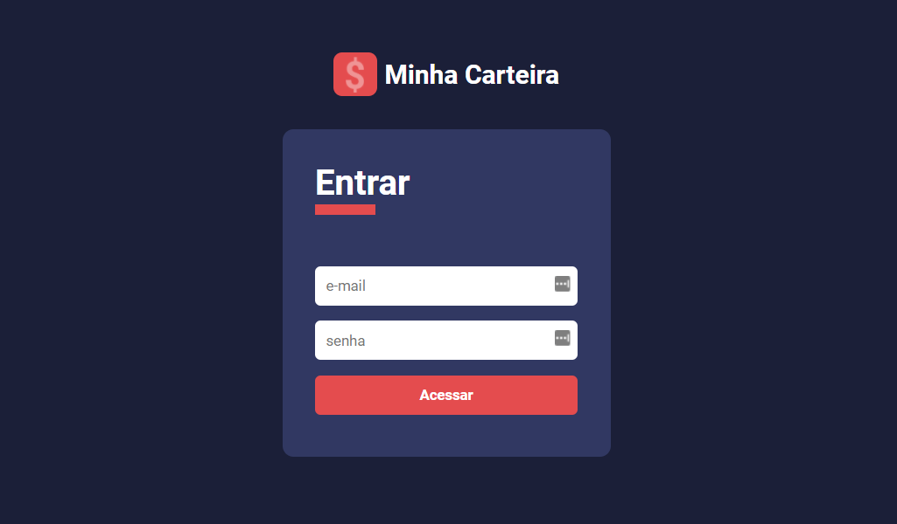
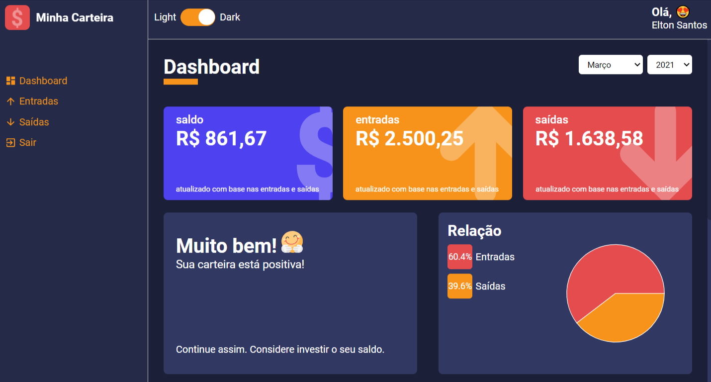

<h1 align="center">
  
</h1>

  <a href="#-tecnologias">Tecnologias</a>&nbsp;&nbsp;&nbsp;|&nbsp;&nbsp;&nbsp;
  <a href="#-projeto">Projeto</a>&nbsp;&nbsp;&nbsp;|&nbsp;&nbsp;&nbsp;
  <a href="#-layout">Layout</a>&nbsp;&nbsp;&nbsp;|&nbsp;&nbsp;&nbsp;
  <a href="#-próximos-passos">Próximos passos</a>&nbsp;&nbsp;&nbsp;

 

  

## 🚀 Tecnologias

Esse projeto foi desenvolvido com as seguintes tecnologias:

- [React](https://reactjs.org)
- [Styled-components](https://styled-components.com/)
- [TypeScript](https://www.typescriptlang.org/)

## 💻 Projeto

Aplicação desenvolvida no curso de [**React e Typescript**](https://www.udemy.com/course/react-e-typescript/) da Udemy do instrutor [**Rodrigo Gonçalves Santana**](https://www.udemy.com/user/rodrigo-goncalves-santana/). 💜

 [**Minha Carteira**](https://minhacarteira-eltonsantos.netlify.app) é uma aplicação totalmente responsiva, podendo ser acessada de qualquer disposivo móvel ou desktop, desenvolvida para o gerenciamento pessoal de entradas e saídas financeiras para que o usuário tenha uma vida com mais economia.

Não há banco de dados. Os dados são carregados de 2 arquivos que contém arrays simulando os repositórios de dados.

Para acessar o [**Minha Carteira**](https://minhacarteira-eltonsantos.netlify.app) entre com o email **teste@teste.com** e a senha **123**.

  

## 🔖 Layout

Nos links abaixo você encontra o layout do projeto responsivo bem como as bibliotecas utilizadas no projeto. Lembrando que você precisa ter uma conta no [**Figma**](http://figma.com/) para acessá-lo.

- [x] Link do prototipo desenvolvido no [**Figma**](https://www.figma.com/file/nOGmUkhcINJt6nd57R4ENu/Untitled?node-id=0%3A1).
- [x] Para os gráficos, foi utilizada a bibliteca [**Recharts**](http://recharts.org/en-US) que é opensource.
- [x] Para efeito de número crescendo eu utilizei o [**React CountUp**](https://www.npmjs.com/package/react-countup).

## 🐾 Próximos passos

- [ ] Possibilitar que o usuário possa cadastrar, editar e excluir suas próprias entradas e saídas; 😍
- [ ] Cadastrar as entradas e saídas em banco de dados (possivelmente utilizar o Firebase); 🎲
- [ ] Possibilitar que o usuário possa selecionar o tipo de categoria para aquela entrada e saída; 🤑
- [ ] E muito mais... ❤💪🏼

## 👨🏻‍💻 Autor

<h3 align="center">
  
   
  <strong>Elton Santos</strong> 🚀
   
   

 

  

 

Feito com ❤️ por Elton Santos 👋🏽 [Entre em contato!](https://www.linkedin.com/in/eltonmelosantos/)

</h3>